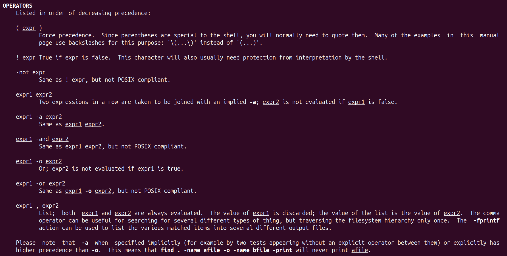

:toc:
:toclevels: 3
:sectnums: 3
:sectnumlevels: 3
:icons: font
:source-highlighter: rouge
= Data Mining - `find`
Haze Wylde

== With `-type f` & `-regextype posix-extended [-regex|-iregex]`

.Find jar files ending with [`-javadoc.jar` | `-sources.jar` | ...]
 find ~/.m2/repository/org/apache/ -type f -regextype posix-extended -regex '^[./].*[-][a-z]+[.]jar$' | sort -d

.Find jar files ending with [`.1.jar` | `.12.jar` | ...]
 find ~/.m2/repository/org/apache/ -type f -regextype posix-extended -regex '^[./].*[.][0-9]+[.]jar$' | sort -d

.Find | Grep
 find ~/.m2/repository/ -type f -regextype posix-extended -regex '^[./].*[.][0-9]+[.]jar$' | sort -d | grep -Eo '([-.a-z+_0-9+\]+[0-9.]+).jar$' | grep -Eo '([-.a-z+_0-9+\]+[0-9.]+).jar' | grep -Eo '([-.a-z+_0-9+\]+[0-9]+)'

.Find | xargs | ln | Grep
 find ~/.m2/repository/ -type f -regextype posix-extended -regex '^[./].*[.][0-9]+[.]jar$' | sort -d | xargs -i ln -s {} $(echo {} | grep -Eo '([-a-z+]+[0-9.]+).jar$' | grep -Eo '([-.a-z+_0-9+\]+[0-9]+)' )

== With Boolean Operators and `[-exec|-execdir]`

[source,bash]
----
find .config/BraveSoftware/brave-browser-*/Profile@*/ \
    \( -iregex '.*indexeddb.*' -o -iregex  '.* Extension.* .*' \) -a -iregex '.*ghmbel.*' \
    -type f  \
    \( -execdir ls  {} \; -execdir file {} \;  \)
----

.Boolean Operators

== Archive | Create | Extract | Split with - `tar` & `split`

- Link: https://unix.stackexchange.com/questions/61774/create-a-tar-archive-split-into-blocks-of-a-maximum-size[create-a-tar-archive-split-into-blocks-of-a-maximum-size]

.Create and Split an Archive
 tar cvzf - dir/ | split -b 200m - sda1.backup.tar.gz.

.Merge splits into one archive
 cat sda1.backup.tar.gz.* | tar xzvf -